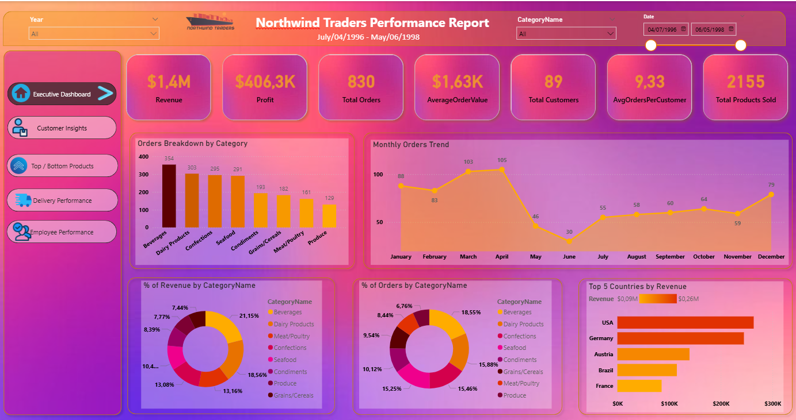
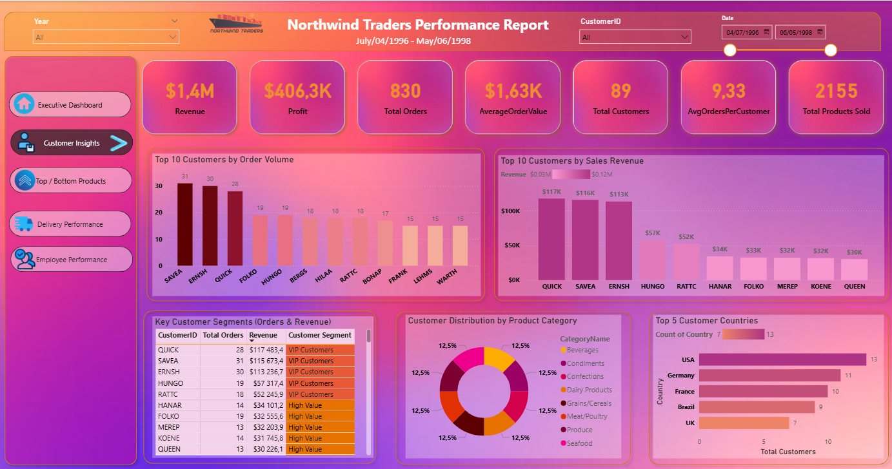
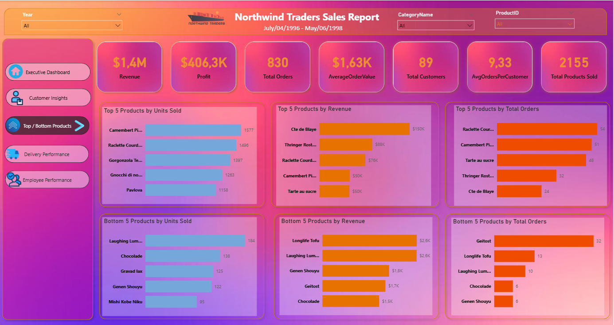
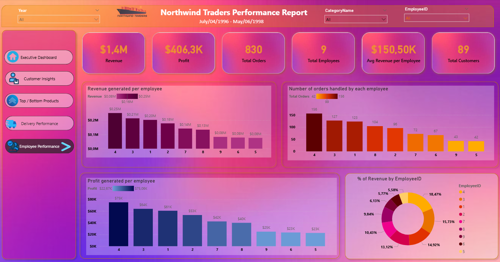
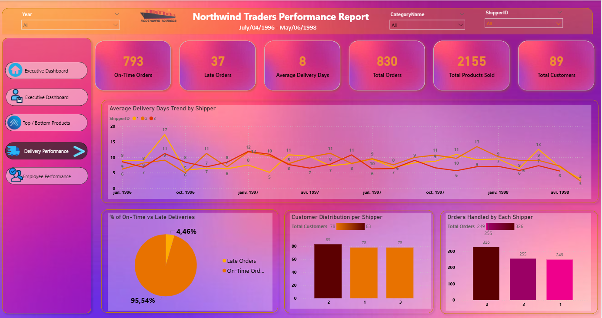

# 📊 Northwind Traders Performance Report

This project presents an **end-to-end Business Intelligence solution** built with **Power BI**, using the classic **Northwind Traders dataset**.  
It focuses on generating actionable insights for business stakeholders through interactive dashboards and KPIs.

---

## 🚀 Project Overview

The **Northwind dataset** (11 relational tables, 4K+ records) was integrated, cleaned, and modeled in Power BI.  
The final report provides a **360° view of company performance**, covering revenue, profitability, customers, products, deliveries, and employee contributions.

**Key Performance Metrics:**
- 💰 **Total Revenue**: $1.4M
- 📈 **Net Profit**: $406.3K  
- 🛒 **Total Orders**: 830
- 👥 **Customers Served**: 89
- 📦 **Products Sold**: 2,155 units
- 🏢 **Employee Count**: 9
- 🌍 **Geographic Reach**: 5+ countries

---

## 📌 Report Pages & Features

### 1️⃣ Executive Dashboard


**Key Features:**
- High-level KPIs: Revenue, Profit, Orders, Customers, Employees  
- Company-wide performance summary  
- Revenue & profit distribution across dimensions  
- Month-over-month trends  

**Insights:**
- Revenue reached $1.4M, with $406K net profit  
- Beverages contributed **21.15% of revenue**  
- Orders peaked in March–April  

---

### 2️⃣ Customer Insights


**Key Features:**
- Top 10 customers by order volume & revenue  
- VIP and high-value customer segmentation  
- Geographic distribution of customers  
- Product category preferences  

**Insights:**
- **QUICK** customer: 28 orders, $117K revenue  
- USA leads with **15 active customers**  
- Balanced distribution across categories  

---

### 3️⃣ Top/Bottom Products


**Key Features:**
- Top 5 & bottom 5 products by revenue, units, orders  
- Category-level performance breakdown  
- Product sales volume comparisons  

**Insights:**
- **Camembert Pierrot**: 1,577 units sold  
- **Côte de Blaye**: $150K revenue (highest)  
- **Raclette Courdavault**: most frequently ordered  

---

### 4️⃣ Employee Performance


**Key Features:**
- Revenue per employee analysis  
- Orders handled by staff  
- Profit contribution per employee  
- Performance ranking  

**Insights:**
- Employee #4: top revenue generator ($0.25M)  
- 5 employees manage **60%+ of orders**  
- Performance distribution across 9 employees  

---

### 5️⃣ Delivery Performance


**Key Features:**
- On-time vs late delivery tracking  
- Shipper performance analysis  
- Customer allocation by shipper  
- Average delivery days  

**Insights:**
- **95.54% on-time rate** (793 orders)  
- 37 late orders recorded  
- Average delivery time: **8 days**  

---

## 🛠️ Technical Implementation

### Data Model
- **11 interconnected tables** with proper relationships  
- **Star schema design** for optimal performance  
- **Power Query** for cleaning & transformation  
- **Custom measures in DAX** for KPIs & rankings  

### Key DAX Measures
```dax
Total Revenue = SUM(Orders[OrderTotal])
Profit Margin = DIVIDE([Total Profit], [Total Revenue], 0)
On-Time Delivery Rate = DIVIDE([On-Time Orders], [Total Orders], 0)
Top Customer Rank = RANKX(ALL(Customers), [Customer Revenue], DESC)
